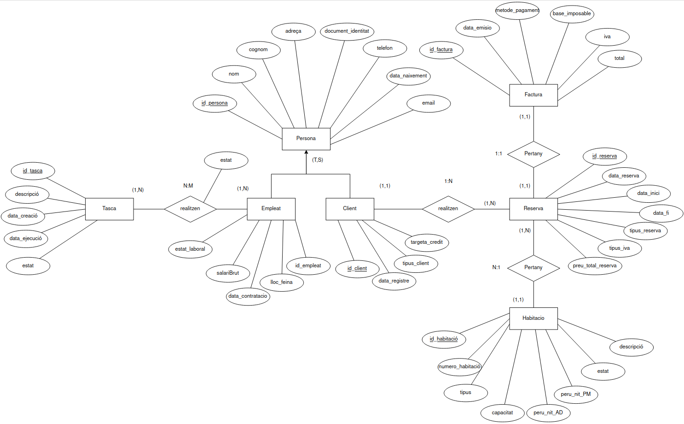
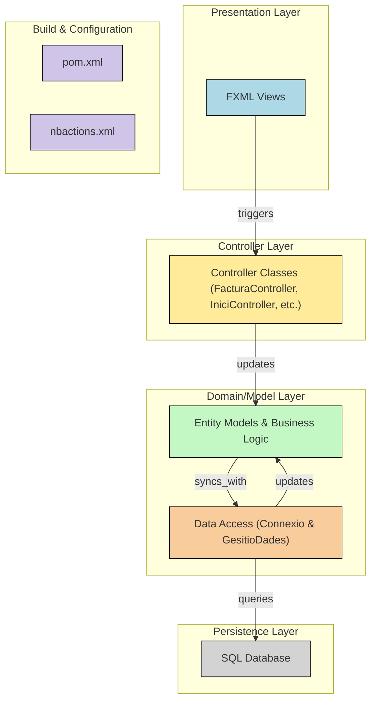

# Sistema gestió d’hotel

## Base de dades

He estructurat la base de dades en 8 taules, primerament he començat amb un disseny conceptual

### Disseny conseptual



 

### Disseny logic - relacional

Després he estructurat un disseny lògic - relacional

PERSONA(id_persona, nom, cognom, adreça, document_identitat, telefon, data_naixement, email)

EMPLEAT(id_empleat, lloc feina, data_contratació, salariBrut, estat_laboral)

On(id_persona) és la clau forana que fa referència a la taula PERSONA (id_persona)

CLIENT(id_client, data_registre, tipus_client, targeta_credit, id_persona)

On(id_persona) és la clau forana que fa referència a la taula PERSONA (id_persona)

TASCA(id_tasca, descripció, data_creació, data_execusió, estat)

EMPLEAT_TASCA(id_empleat, id_tasca, estat)

FACTURA(id_factura, data_emisió, metode_pagament, base_imposable, iva, total)

HABITACIÓ(id_habitació, numero_habitació, tipus, capacitat, preu_nit_AD, preu_nit_PM, estat, descripció)

RESERVA(id_reserva, data_reserva, data_inici, data_fi, tius_reserva, tipus_iva, preu_total_reserva, id_client, id_habitació, id_factura)

On(id_client) és la clau forana que fa referència a la taula CLIENT (id_client)

On(id_factura) es la clau forana que fa refèrencia a la taula FACTURA (id_factura)

### Creació de taules

```sql
#Creo les taules
CREATE TABLE Persona(
	id_persona int PRIMARY KEY NOT null AUTO_INCREMENT,
	nom varchar(15) NOT null,
	cognom varchar(15) NOT null,
	adresa varchar(35) NOT null,
	document_identitat varchar(9) NOT null,
	telefon int NOT null,
	data_naixement DATE not null,
	email varchar(30) not null
);
CREATE TABLE Empleat(
	id_empleat int PRIMARY KEY NOT null AUTO_INCREMENT,
	lloc_feina varchar(15) NOT null,
	data_contratacio date NOT null,
	salariBrut int NOT null,
	estatLaboral varchar(15) NOT null,
	id_persona int,
	FOREIGN KEY (id_persona) REFERENCES Persona (id_persona)
ON DELETE CASCADE
ON UPDATE CASCADE
);
CREATE TABLE Client(
	id_client int PRIMARY KEY NOT null AUTO_INCREMENT,
	data_registre date NOT null,
	tipus_client varchar(10) NOT null,
	targeta_credit varchar(14) NOT null,
	id_persona int,
	FOREIGN KEY (id_persona) REFERENCES Persona (id_persona)
ON DELETE CASCADE
ON UPDATE CASCADE
);

CREATE TABLE Tasca(
	id_tasca int PRIMARY KEY NOT null AUTO_INCREMENT,
	descripcio varchar(40) NOT null,
	data_creacio date NOT null,
	data_execusio date not null,
	estat varchar(10)
);

CREATE TABLE Empleat_Tasca(
	id_empleat int,
	id_tasca int NOT null,
	PRIMARY KEY (id_empleat, id_tasca),
	FOREIGN KEY (id_empleat) REFERENCES Empleat (id_empleat)
ON DELETE CASCADE
ON UPDATE CASCADE,
	FOREIGN KEY (id_tasca) REFERENCES Tasca (id_tasca)
ON DELETE CASCADE
ON UPDATE CASCADE,
	estat varchar(12) not null
);

CREATE TABLE Factura(
	id_factura int PRIMARY KEY NOT null AUTO_INCREMENT,
	data_emisio date NOT null,
	metode_pagament varchar(10) NOT null,
	base_imposable double,
	iva int,
	total double
);

CREATE TABLE Habitacio(
	id_habitacio int PRIMARY KEY NOT null AUTO_INCREMENT,
	numero_habitacio int NOT null,
	tipus varchar(10) NOT null,
	capacitat int not null,
	preu_nit_AD double not null,
	preu_nit_MP double not null,
	estat varchar(15),
	descripcio varchar(50)
);

CREATE TABLE Reserva(
	id_reserva int PRIMARY KEY NOT null AUTO_INCREMENT,
	data_reserva date NOT null,
	data_inici date not null,
	data_fi date not null,
	tipus_reseva varchar(2),
	tipus_iva int not null,
	preu_total_reseva double not null,
	id_client int,
	FOREIGN KEY (id_client) REFERENCES Client (id_client)
ON DELETE CASCADE
ON UPDATE CASCADE,
	id_habitacio int not null,
	FOREIGN KEY (id_habitacio) REFERENCES Habitacio (id_habitacio),
	id_factura int,
	FOREIGN KEY (id_factura) REFERENCES Factura (id_factura)
ON DELETE CASCADE
ON UPDATE CASCADE
);
```

### Inserció de dades

```sql
#Inserto taules
INSERT INTO Persona
VALUES
(1,"Joan","Garcia","Carrer Major 12, BCN","12345678X","612345678","1985-02-15","joan.garcia@example.com"),
(2,"Maria","López","Carrer del Sol 5, MTL","87654321Y","698765432","1990-07-22","maria.lopez@example.com"),
(3,"Pere","Ruiz","Avinguda Diagonal 100","11223344Z","612345679","1978-11-05","pere.ruiz@example.com"),
(4,"Pau","Romero","Plaça major 34","43465643U","943245436","2004-10-20","paro434@exemple.com"),
(5,"Pere","Lluis","Carrer don jusep 13","34425423V","632454365","1997-07-10","pere.lluis@exemple.com"),
(6,"Nicolas","Rodrigez","Plaça narnea 3","34343269M","634243289","2005-01-13","niro412@exemple.com");

INSERT INTO Empleat
VALUES
(1,"Recepcionista","2023-01-01",18000,"Actiu",1),
(2,"Cambrer","2024-03-15",15000,"Fix discontinu",3),
(3,"Director","2020-05-30",35000,"Actiu",4),
(4,"Cuiner","2015-07-20",23000,"Baixa",5);

INSERT INTO Client
VALUES
(1,"2022-06-10","Regular","1234-5678-9876",1),
(2,"2024-02-05","VIP","1111-2222-3333",2),
(3,"2023-07-18","Regularx","4424-6542-5653",6);

INSERT INTO Tasca
VALUES
(1,"Desinfectar taronges","2025-02-01","2025-02-02","Finalitzat"),
(2,"Netejar habitació","2025-02-01","2025-02-03","En curs"),
(3,"Rentar plats","2025-02-03","2025-02-04","Pendent");
INSERT INTO Empleat_Tasca
VALUES
(1,1,"Finalitzat"),
(2,2,"En curs"),
(3,1,"Finalitzat"),
(1,3,"Pendent"),
(3,3,"Pendent");

INSERT INTO Factura
VALUES
(1,"2025-02-07","Targeta",75,21,90.75),
(2,"2025-02-10","Efectiu",270,10,297),
(3,"2025-02-10","Targeta",225,15,258.75),
(4,"2025-02-10","Targeta",600,14,684);

INSERT INTO Habitacio
VALUES
(1,101,"Individual",1,50,75,"lliure","Habitació petita per 1 persona"),
(2,102,"Doble",2,90,120,"lliure","Habitació gran per 2 persones"),
(3,103,"Familiar",4,150,190,"lliure","Habitació gran per una familia");

INSERT INTO Reserva
VALUES
(1,"2025-02-05","2025-02-06","2025-02-07","PM",21,90.75,1,1,1),
(2,"2025-02-05","2025-02-07","2025-02-10","AD",10,297,2,2,2),
(3,"2025-02-04","2025-02-08","2025-02-10","PM",15,258.75,3,1,3),
(4,"2025-02-01","2025-02-06","2025-02-10","AD",14,684,1,3,4);
```

### Resultat

Han quedat 8 taules les quals accedeixo des de l’aplicació


I estan relacionades entre si


## Documentació sobre el codi

### Diagrama UML


Això seria una versió simplificada del que seria les classes principals i els atributs que s’extreuen de la base de dades, és cert que després tinc la classe model que és on es guarda tot en memòria i la classe gestió de dades que exporta totes les dades, i tots els controladors. 

### Comentaris sobre el codi

En l’aplicació he importat totes les dades de la base de dades en iniciar l’aplicació generant diverses classes fortament enllaçades entre si, ja que cada classe te localitzada les classes relacionades sigui amb diverses llistes o amb la classe en si.

En crear o modificar una classe a part de modificar-se o crear-se en memòria també es creen en la base de dades.

## Funcionament de l’aplicació

### Inici

Entres a l’aplicació i s’obre una pantalla de gestió on pots visualitzar totes les persones, empleats i clients, hi ha una altra pantalla d'on estan les reserves i les tasques, seleccionant una persona, tasca o reserva pots veure que pertany a cada cosa si pitges el botó filtrar o el checkbox filtrar automàtic està activat.

També pots editar qualsevol persona, reserva, tasca seleccionada o crear-ne una nova.


Quan crees una persona hi han camps que es posen automaticament, com els ids, i amb el listview pots veure quin empleat o client hi ha seleccionat, es poden assignar els rols amb un combobox i pots afegir nous treballadors


Las reserves es visualitzen de una manera semblant, hi ha un combobox per veure els clients, cuan selecciones un client pots veure les reserves que te el client, i ha el camp preu que es calcula automaticament amb l’habitació, els dies i el via


Quan una reserva esta seleccionada pots generar una factura si no existeix o veure la existent, quan una reserva te una factura les dades no es poden cambiar.


En la factura les dades ja estan autocomplaences menys el mètode de pagament que l'usuari se selecciona un i llavors pitges un botó de crear i la factura es queda creada amb les dades no modificables.


En les tasques veus diverses dades, entre elles els empleats assignats, amb l'estat en el qual porten la tasca, els empleats es poden afegir i l'estat es calcula depenent els empleats assignats.


## Mermaind de la pagina
Aquest es un diagrama de la pagina afegit raderament d'entregar el projecte fet per la web gitdiagram.com, l'he afegit perqué m'ha semblat molt guai com ha quedat i ho he pogut integrar amb el redme pero no te res a veure amb la documentació


